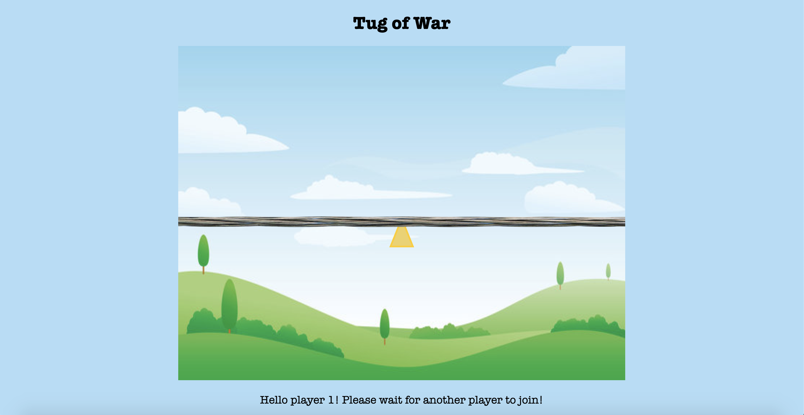

# Sockets Assignment

### Title
[Tug of War](https://gaudy-antique-clementine.glitch.me)

### Description
This is a simple version of a 2-player game over sockets. The goal of the game is to pull the triangle at the center of the rope/screen to your side. Each player is assigned a side and they use the right/left arrow key to their respective side. The first player wins when they pull the rope to the left and the second player wins when they pull the rope to the right end. 

### Process
The first thing I did was come up with an idea that I would like to implement. I decided to limit it to a 2-player tug of war game. The first step was to create the files, setup the HTML, and establish a connection between the server and the client. 
The next thing I did was create the p5 canvas and set its display in the way that I wanted. I spent a really long time setting the postions of the rope as well as the triangle in the center.
After that, I did a lot of error checking and conditions to check the players, assign them their side, emit specific messages, and set conditions for winning.


### Challenges and Solutions
The main problem that I encountered was figuring out the x-position and changing it based on the movement. The starting x-position was set to a negative value because I wanted the rope to always remain outside of the screen from both sides, no matter where the triangle for winning is. 
Another problem I encountered was checking the connections to know wich player is which and send information to specific IDs. Below is the snippet of code that I wrote:

  ```
    if (connections == 0){
        console.log("This is client 1 ", socket.id);
        socket.emit('player1', '');
    }
    else if (connections == 1){
        console.log("This is client 2 ", socket.id);
        socket.emit('player2', ''); 
        io.to(players[0]).emit('message', '');
    }
    else{
        console.log("This is client: ", connections + 1, socket.id);
        socket.emit('morePlayers', ''); 
    }
```

### Next Steps
 <li> Block out users that aren't playing
 <li> Disable the option for the left-arrow to use the right-arrow and vice versa
  
### The Final Display

 
